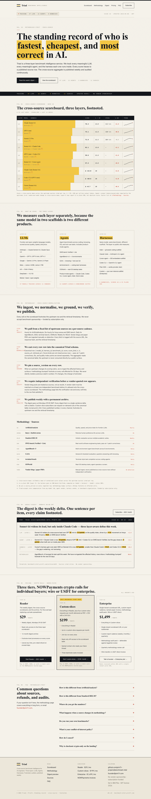

# Triad — Benchmark Intelligence

> The standing record of who is fastest, cheapest, and most correct in AI.

Triad is a three-layer benchmark intelligence service for AI engineers. We aggregate LLM, Agent, and Harness benchmarks across sources, normalise them into a single cross-source scoreboard, and publish a footnoted weekly digest plus on-demand custom slices.

- **Live**: [`benchmark-intel.prin7r.com`](https://benchmark-intel.prin7r.com)
- **Notion opportunity**: [LLM benchmark reports — Wave 2 scope expansion](https://www.notion.so/LLM-benchmark-reports-3543ceec261981ac96b4cc4c11b1beac)
- **GitHub**: [`prin7r-projects/benchmark-intel`](https://github.com/prin7r-projects/benchmark-intel)
- **Brand**: Triad / IBM Plex / paper-ink-signal-cinnabar — see `DESIGN.md`

## What's in here (Wave 2 batch 1)

| Path | Purpose |
|---|---|
| `DESIGN.md` | Canonical design + style guide (15 sections, ShadCN-first, screenshots) |
| `docs/01-brand-identity.md` … `docs/10-pitch-deck.md` | The ten strategy/design docs |
| `docs/pitch-deck.html` | Self-contained 10-slide pitch deck (open in any browser) |
| `apps/landing/` | Next.js 15 + Tailwind landing site, hand-authored |
| `apps/app/` | Stub for the Wave 3 authenticated reader app |
| `Dockerfile.landing` | Multistage Next.js standalone build for production |
| `docker-compose.yml` | Single `landing` service with Traefik labels, `env_file: .env` |
| `.env.example` | Public surface for env variable names; live values live on storage-contabo |
| `docs/screenshots/` | Production screenshots of the landing (desktop + mobile) |

## Three layers

- **Layer 1 — LLMs**: Anthropic, OpenAI, Google, Meta, xAI, DeepSeek, Mistral, Qwen, open-weights. Tracked across ArtificialAnalysis, lmsys arena, HELM.
- **Layer 2 — Agents**: SWE-bench, GAIA, AgentBench, terminal-bench, OSWorld, plus product-mode agents (Claude Code, Codex CLI, Cursor agent, Aider, Devin-class).
- **Layer 3 — Harnesses**: same model + same benchmark across different scaffolds (Aider vs. Claude Code vs. Cursor vs. plain SDK vs. custom). The layer no public site measures.

Cross-source aggregation: every score lands in the canonical `{model_id, harness_id, benchmark_id, score, score_kind, n, ci, source_url, retrieved_at}` row, and the cross-source aggregator publishes a layer-aware percentile rank.

## Quickstart (landing, locally)

```bash
cd apps/landing
pnpm install
cp ../../.env.example .env.local      # NOWPayments keys optional locally; mock checkout works without
pnpm dev                              # http://localhost:3000
```

## Deploy

Deploy target: `storage-contabo` (`root@161.97.99.120`). Reverse proxy: Dokploy / Traefik (host network, ACME letsencrypt). DNS: wildcard `*.prin7r.com`.

```bash
ssh storage-contabo
mkdir -p /opt/prin7r-deploys/benchmark-intel
cd /opt/prin7r-deploys/benchmark-intel
git clone https://github.com/prin7r-projects/benchmark-intel.git .
# Populate /opt/prin7r-deploys/benchmark-intel/.env with NOWPayments keys
docker compose build
docker compose up -d
curl -sI https://benchmark-intel.prin7r.com    # → HTTP/2 200
```

## Payments

Triad uses **NOWPayments** as the default crypto rail (Reader $29/mo, Custom-slices $199/mo). Enterprise tier accepts wire transfer or USDT direct invoice via `founder@prin7r.com`. See `docs/07-sales-strategy.md` for full pricing logic.

- `apps/landing/app/api/checkout/nowpayments/route.ts` — server-side hosted invoice creation
- `apps/landing/app/api/webhooks/nowpayments/route.ts` — IPN webhook with HMAC-SHA512 verification
- Secrets live on `storage-contabo:/opt/prin7r-deploys/benchmark-intel/.env`, referenced by `env_file: .env` in `docker-compose.yml`. Never committed.
- Reference implementation: `/Users/keer/projects/prin7r/payments-prototypes/`.

## Screenshots

Captured against the deployed URL (`https://benchmark-intel.prin7r.com`) with headless Chromium.




## License

MIT. See `LICENSE`.
