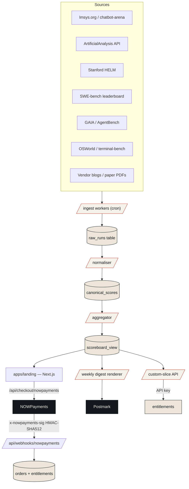
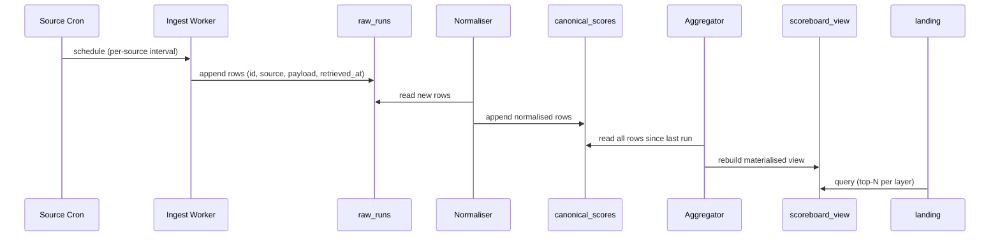

# 02 — Architecture

## System overview

Triad ingests benchmark results from multiple upstream sources, normalises them into a single canonical row schema, persists them to a versioned datastore, and serves three surfaces: a public scoreboard (the landing site you're looking at), a weekly digest (email + RSS), and a paid custom-slice API.

## Components

| Component | Role | Stack | Cadence |
|---|---|---|---|
| `apps/landing` | Public marketing + scoreboard preview + checkout entry point | Next.js 15 App Router + Tailwind | Always-on |
| `apps/app` (stub for Wave 2) | Authenticated reader app for the scoreboard, custom slices, digest archive | Next.js 15 + open-saas (Wasp) | Wave 3 |
| `apps/api` (stub) | Public REST API for paying customers (custom slices) | Bun + Hono | Wave 3 |
| Ingest workers | Pull benchmark results from each source on a per-source cadence | Bun + cron | Per-source (see below) |
| Normaliser | Cast each raw row into the canonical schema (model_id, harness_id, benchmark_id, score, score_kind, n, ci, source_url, retrieved_at) | Bun | Per-batch |
| Aggregator | Compute the cross-source score and the percentile rank per benchmark | Bun + DuckDB | Hourly |
| Digest renderer | Render the weekly newsletter from the latest aggregated state | Next.js MJML | Mondays 09:00 GMT |
| Custom-slice API | Serve filtered cuts of the canonical table (e.g. "Sonnet 4.6 across all SWE-bench harnesses") | Hono + DuckDB-WASM | On demand |
| Order store | Track NOWPayments orders, IPN webhook events, and entitlements | Postgres (Wave 3); JSON file in Wave 2 batch 1 | Always-on |

## Data flow

## Source cadences

| Source | Cadence | Reason |
|---|---|---|
| ArtificialAnalysis API | hourly | API quota allows it; their refresh cadence is short |
| lmsys arena | every 6h | Updates ~daily |
| SWE-bench leaderboard | every 6h | Updates a few times a week |
| HELM | weekly | Methodology releases are infrequent |
| GAIA / AgentBench | daily | New agents are added but scores don't move often |
| OSWorld / terminal-bench | daily | Same |
| Vendor blogs / paper PDFs | manual on detection | Human review needed; we never auto-publish a vendor-quoted score |

## Deploy topology (Wave 2 batch 1)

- **Server:** `storage-contabo` (`root@161.97.99.120`).
- **Reverse proxy:** Dokploy / Traefik in host-network mode, watches `/var/run/docker.sock`, ACME via Let's Encrypt HTTP-01 to `kee22r@gmail.com`.
- **DNS:** wildcard `*.prin7r.com → 161.97.99.120` already provisioned in Cloudflare; no per-subdomain DNS needed.
- **Runtime:** single `landing` container (Node 22 alpine, Next.js 15 standalone) listening on `:3000`, exposed only inside the Docker network and routed by Traefik labels.
- **Secrets:** delivered via `.env` placed at `/opt/prin7r-deploys/benchmark-intel/.env` (gitignored), referenced by `env_file: .env` in compose.
- **Webhook URL:** `https://benchmark-intel.prin7r.com/api/webhooks/nowpayments`.

## Wave 3 evolution

- Add `apps/app` (open-saas / Wasp) for authenticated reader experience and digest-archive search.
- Move order store from filesystem JSON to a managed Postgres + Drizzle.
- Add `apps/api` (Bun + Hono) for the custom-slice REST API.
- Add a small DuckDB engine that lets paying customers run their own SQL slice via a sandboxed runner.
- Add Plisio + Reown checkout buttons next to NOWPayments (already documented in `07-sales-strategy.md`).
- Add an alert pipeline (webhook + email) when a model/harness moves more than X percentile on any benchmark.

## Failure modes and mitigations

| Failure | Mitigation |
|---|---|
| One upstream source goes dark | Aggregator continues with the rest; the affected benchmark is greyed out on the board with a footnote |
| Vendor changes their blog format | Manual ingestion path means a human reviewer catches it; never silent |
| NOWPayments IPN replay | HMAC-SHA512 with the order id in the signed body; idempotent upsert keyed on order id |
| Traefik certificate expiry | Let's Encrypt renews 30 days early; we monitor with a daily curl + cert-expiry check |
| Container crash | `restart: unless-stopped`, no state in-container, so a restart is free |
