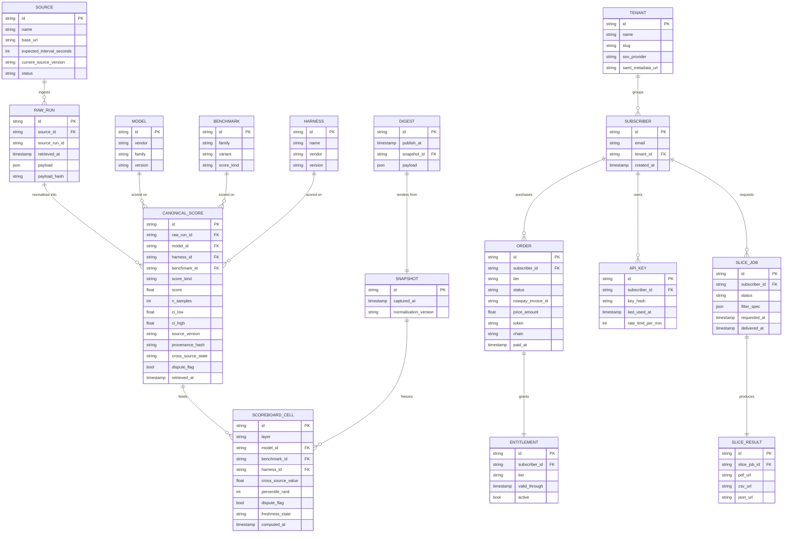

# 12 — Technical specification

This document is the runtime contract between Triad's strategy/design layer (docs 01–11) and any future implementation work. It assumes the reader has already read `02-architecture.md` (the higher-level system overview) and `11-user-stories-and-scenarios.md` (the behaviour contract). Doc 02 sets the architectural framing; this doc adds the runtime, schema, API, and operational detail.

## 1. Architecture overview

Triad is a content-aggregation product. The pipeline shape is **fan-in → normalise → store → fan-out**. Three ingestion lanes (one per layer) feed a single canonical store, which serves three publication surfaces.

### 1.1 Services and ports (deploy topology)

| Service | Path | Stack | Port (internal) | Public route |
|---|---|---|---|---|
| `landing` | `apps/landing` | Next.js 15 standalone | `:3000` | `benchmark-intel.prin7r.com` |
| `app` (Wave 3) | `apps/app` | Next.js 15 + Auth.js + Drizzle | `:3001` | `app.benchmark-intel.prin7r.com` |
| `api` (Wave 3) | `apps/api` | Bun + Hono | `:3010` | `api.benchmark-intel.prin7r.com` |
| `worker-ingest-llm` (Wave 3) | `workers/ingest-llm` | Bun + cron | n/a | n/a |
| `worker-ingest-agent` (Wave 3) | `workers/ingest-agent` | Bun + cron | n/a | n/a |
| `worker-ingest-harness` (Wave 3) | `workers/ingest-harness` | Bun + cron | n/a | n/a |
| `worker-normaliser` (Wave 3) | `workers/normaliser` | Bun | n/a | n/a |
| `worker-aggregator` (Wave 3) | `workers/aggregator` | Bun + DuckDB CLI | n/a | n/a |
| `worker-digest` (Wave 3) | `workers/digest` | Bun + MJML | n/a | n/a |
| `worker-slice` (Wave 3) | `workers/slice` | Bun + headless Chromium | n/a | n/a |
| `postgres` (Wave 3) | n/a | Postgres 17 | `:5432` (internal only) | n/a |
| `redis` (Wave 3) | n/a | Redis 7 | `:6379` (internal only) | n/a |

Wave 2 batch 1 ships only the `landing` service. Postgres and the workers come online with Wave 3.

### 1.2 Three ingestion pipelines

Each lane is independent. A failure in one does not block the others.

#### Lane 1 — LLM ingestion
Sources (per `02-architecture.md`):
- ArtificialAnalysis API (hourly).
- lmsys.org / chatbot-arena public leaderboard JSON (every 6h).
- Stanford HELM weekly release (weekly).
- HuggingFace Open LLM Leaderboard public table (every 6h).
- OpenAI/Anthropic/Google/Meta/xAI/DeepSeek/Mistral/Qwen vendor blogs (manual on detection — never auto-published).

Worker behaviour: pull → store raw payload in `raw_runs` keyed by `(source, source_run_id, retrieved_at)` → enqueue normalisation.

#### Lane 2 — Agent ingestion
Sources:
- SWE-bench leaderboard (every 6h).
- GAIA leaderboard (daily).
- AgentBench public table (daily).
- terminal-bench (daily).
- OSWorld (daily).
- WebArena, MLE-Bench (daily).
- Vendor blog mentions of agent runs (manual on detection).

Worker behaviour: same as Lane 1. Agent rows carry an additional `harness_id` field; if the source publishes runs without specifying the harness, the harness is recorded as `unknown` and the cell is excluded from cross-harness comparison.

#### Lane 3 — Harness ingestion
This is the unique lane. Sources:
- Public benchmark sites that *do* surface harness info (SWE-bench's `agent + scaffold` columns).
- GitHub repos for harnesses (Aider, Claude Code documentation, Cursor agent, Codex CLI, Cline, plain-SDK examples) — we read their README + benchmark sections + their published-result tables.
- Independent reproducibility runs published by community researchers.
- Vendor blogs (manual on detection, never auto-published).

Worker behaviour: harness lane focuses on the `(model, benchmark, harness, score)` four-way join. When a row has an explicit harness, it goes into the `harness` view. When it does not, it stays in the `agent` view only.

### 1.3 Cross-source normalisation

The normalisation stage takes a `raw_run` and emits one or more `canonical_scores` rows.

Steps:
1. **Identify** — match the row's vendor-string (e.g. `claude-3.5-sonnet-20241022`) to a canonical `model_id` via a lookup table (manually curated; missing entries land in a review queue).
2. **Score-kind cast** — every source uses a different scoring metric. `pass@1` (SWE-bench), `Elo` (lmsys), `composite quality 0-100` (ArtificialAnalysis), `accuracy` (HELM). Each `score_kind` is recorded as-is on the canonical row; downstream the aggregator handles the cast.
3. **Confidence interval** — when the source publishes a sample size and a confidence band, we record both. When it doesn't, we record `n=null, ci=null` and downgrade the row's weight in the aggregator.
4. **Methodology version pin** — record the source's `source_version` at ingest time. When the source's version bumps, we re-ingest the entire history and emit a `methodology_bumped` event for the aggregator.
5. **Provenance hash** — every canonical row carries a `provenance_hash` = sha256(source_url + retrieved_at + source_version + raw_payload_hash). This is the audit-drawer's lookup key.

The aggregator runs hourly and computes:
- A normalised z-score per `(score_kind)` cohort within each benchmark.
- The cross-source value as the median z-score across sources for the same `(model_id, benchmark_id, harness_id)` triple.
- A percentile rank within `(layer, benchmark_id)` cohort.
- Inter-source variance — when above a threshold, the cell is marked `dispute_flag: true` (per EC1 in doc 11).

### 1.4 Digest generator

A worker that runs every Sunday 23:00 GMT (10h before the Monday 09:00 GMT publish slot):
- Snapshots `canonical_scores` and `scoreboard_view` to an immutable `snapshots` table.
- Computes deltas vs. last week's snapshot per `(layer, model, harness, benchmark)` cell.
- Selects the top deltas (above a percentile threshold) for each layer's section.
- Renders MJML → HTML → text-only fallback into a digest payload.
- Stores the digest in `digests` (one row per week with its full payload + the snapshot id).
- Pushes static-built digest pages to the object store (R2 or local volume).
- Does NOT send emails; the email-send worker runs at 09:00 Monday and reads the latest digest.

### 1.5 Custom-slice query engine

Two paths:
- **API path** (`GET /v1/slice` with structured filters): direct query to `canonical_scores` + joins. Postgres at production; DuckDB-WASM acceptable for MVP.
- **Free-text path** (`POST /v1/slice` with a natural-language question): a parser worker calls gpt-5-mini to translate the text into the structured filters, then routes to the structured path. Low-confidence parses go to `slice_review_queue` for human review.

Both paths produce a normalised filter spec, run a parameterised query, and emit a `slice_result` JSON. For self-serve API the result is the response. For the slice-export path (PDF + CSV) a downstream `worker-slice` renders the result via headless Chromium against an MJML-style template.

## 2. Data model

### 2.1 ER diagram



### 2.2 SQL schema sketch (Postgres dialect)

The Wave 2 MVP can use SQLite with the same shape; the path to Postgres is a clean migration because we avoid SQLite-specific idioms (no `ROWID` references, no `WITHOUT ROWID`).

```sql
-- core reference tables
create table sources (
  id text primary key,
  name text not null,
  base_url text not null,
  expected_interval_seconds int not null,
  current_source_version text,
  status text not null default 'active' -- active|degraded|offline
);

create table models (
  id text primary key,           -- e.g. "anthropic/sonnet-4.6"
  vendor text not null,
  family text not null,
  version text not null,
  released_at timestamptz
);

create table benchmarks (
  id text primary key,           -- e.g. "swe-bench-verified@1.0"
  family text not null,          -- e.g. "swe-bench"
  variant text not null,         -- e.g. "verified"
  score_kind text not null       -- e.g. "pass@1", "elo", "accuracy", "composite-0-100"
);

create table harnesses (
  id text primary key,           -- e.g. "claude-code@1.4"
  name text not null,
  vendor text,
  version text
);

-- ingestion
create table raw_runs (
  id text primary key,
  source_id text not null references sources(id),
  source_run_id text not null,
  retrieved_at timestamptz not null,
  payload jsonb not null,
  payload_hash text not null,
  unique (source_id, source_run_id, retrieved_at)
);
create index raw_runs_retrieved_at_idx on raw_runs (retrieved_at desc);

-- normalised
create table canonical_scores (
  id text primary key,
  raw_run_id text not null references raw_runs(id),
  model_id text not null references models(id),
  harness_id text references harnesses(id),
  benchmark_id text not null references benchmarks(id),
  score_kind text not null,
  score double precision not null,
  n_samples int,
  ci_low double precision,
  ci_high double precision,
  source_version text,
  provenance_hash text not null,
  cross_source_state text not null default 'pending', -- pending|verified|disputed
  dispute_flag bool not null default false,
  retrieved_at timestamptz not null
);
create index canonical_lookup_idx on canonical_scores (model_id, benchmark_id, harness_id, retrieved_at desc);

-- aggregator output (materialised)
create table scoreboard_cells (
  id text primary key,
  layer text not null,           -- llm|agent|harness
  model_id text not null references models(id),
  benchmark_id text not null references benchmarks(id),
  harness_id text references harnesses(id),
  cross_source_value double precision not null,
  percentile_rank int not null,  -- 0-100
  dispute_flag bool not null default false,
  freshness_state text not null, -- fresh|stale|very_stale|source_offline
  computed_at timestamptz not null default now(),
  unique (layer, model_id, benchmark_id, harness_id)
);

-- snapshots (immutable)
create table snapshots (
  id text primary key,
  captured_at timestamptz not null,
  normalisation_version text not null,
  cells_json jsonb not null
);

create table digests (
  id text primary key,
  publish_at timestamptz not null,
  snapshot_id text not null references snapshots(id),
  payload jsonb not null,
  static_html_url text,
  unique (publish_at)
);

-- subscriber + billing
create table tenants (
  id text primary key,
  name text not null,
  slug text not null unique,
  sso_provider text,             -- saml|oidc|null
  saml_metadata_url text
);

create table subscribers (
  id text primary key,
  email text not null,
  tenant_id text references tenants(id),
  created_at timestamptz not null default now(),
  unique (email)
);

create table orders (
  id text primary key,
  subscriber_id text not null references subscribers(id),
  tier text not null,            -- reader|custom-slices|enterprise
  status text not null,          -- created|waiting|confirming|confirmed|partially_paid|expired|failed
  nowpay_invoice_id text unique,
  price_amount double precision not null,
  paid_amount double precision,
  token text,                    -- USDT|USDC|BTC|...
  chain text,                    -- TRC20|ERC20|BTC|...
  paid_at timestamptz,
  expires_at timestamptz,
  raw_ipn_payload jsonb,
  created_at timestamptz not null default now()
);

create table entitlements (
  id text primary key,
  subscriber_id text not null references subscribers(id),
  tier text not null,
  valid_through timestamptz not null,
  active bool not null default true,
  created_at timestamptz not null default now(),
  unique (subscriber_id, tier)
);

create table api_keys (
  id text primary key,
  subscriber_id text not null references subscribers(id),
  key_hash text not null unique,
  rate_limit_per_min int not null default 60,
  last_used_at timestamptz,
  created_at timestamptz not null default now()
);

-- slice jobs
create table slice_jobs (
  id text primary key,
  subscriber_id text not null references subscribers(id),
  status text not null,          -- queued|parsing|review|running|done|failed
  filter_spec jsonb not null,
  free_text_input text,
  parser_confidence float,
  requested_at timestamptz not null default now(),
  delivered_at timestamptz,
  reviewer_id text,
  failure_reason text
);

create table slice_results (
  id text primary key,
  slice_job_id text not null references slice_jobs(id),
  pdf_url text,
  csv_url text,
  json_url text,
  signed_url_expires_at timestamptz
);

-- audit + observability
create table api_audit (
  id text primary key,
  api_key_id text references api_keys(id),
  endpoint text not null,
  params_hash text not null,
  ts timestamptz not null default now(),
  response_size int,
  status int,
  ip text
);

create table normalisation_log (
  id text primary key,
  raw_run_id text not null references raw_runs(id),
  rule_version text not null,
  emitted_canonical_ids text[],
  notes text,
  ts timestamptz not null default now()
);
```

### 2.3 Indexes and retention

- `raw_runs` retains all rows for 5 years (audit). Partitioned by `retrieved_at` month at Postgres level.
- `canonical_scores` retains all rows indefinitely; the table is small (rows × scoreboard cells × time = ~10M rows over 5y).
- `api_audit` retains 90 days hot + 1y cold (S3 export).
- `snapshots` retains forever (immutable; the audit story depends on this).

## 3. API contracts

All authenticated endpoints accept `Authorization: Bearer <api_key>` (Custom-slices+) OR a signed cookie session (web app only). All responses are JSON unless noted. All 2xx responses include `X-Triad-Normalisation-Version` and `X-Triad-Snapshot-Id` headers.

### 3.1 Public endpoints (no auth)

#### `GET /v1/scoreboard`
Returns the public scoreboard preview (top-N rows per layer, 24h-stale).
- Query: `layer=llm|agent|harness` (optional, default = all layers).
- Response 200:
  ```json
  {
    "snapshot_id": "snap_2026_05_07T0000Z",
    "captured_at": "2026-05-07T00:00:00Z",
    "layers": {
      "llm":     [ /* top 10 rows */ ],
      "agent":   [ /* top 10 rows */ ],
      "harness": [ /* top 10 rows */ ]
    },
    "stale_notice": "preview is up to 24h stale; live access requires a Reader subscription"
  }
  ```
- Errors: 503 if upstream `scoreboard_cells` query fails.

#### `GET /v1/sources`
Returns the methodology source table.
- Response 200:
  ```json
  {
    "sources": [
      {"id": "artificial-analysis", "name": "ArtificialAnalysis", "expected_interval_seconds": 3600, "current_source_version": "2026.05.07", "status": "active"},
      ...
    ]
  }
  ```

#### `POST /api/checkout/nowpayments`
Body: `{ "tier": "reader" | "custom-slices", "email": "user@example.com" }`.
- Server-side calls NOWPayments hosted invoice API (USDT default; merchant supports a chain selector at the NOWPay layer).
- Response 200: `{ "invoice_url": "https://nowpayments.io/payment/?iid=..." }`.
- Errors: 400 invalid tier; 502 upstream NOWPay failure (with retry-after).

#### `POST /api/webhooks/nowpayments`
NOWPayments IPN webhook.
- Header: `x-nowpayments-sig` — HMAC-SHA512 of the request body using the IPN secret.
- Body: NOWPayments IPN schema (see NOWPay docs).
- Verify the signature; reject with 401 if invalid.
- Idempotent: keyed on `payment_id`. Repeat IPNs for the same payment update the `orders` row in place.
- State machine: `created → waiting → confirming → confirmed | partially_paid → confirmed | expired | failed`. On `confirmed`, upsert `entitlements`.
- Response 200: `{ "ok": true }`.

### 3.2 Subscriber endpoints (Reader+)

#### `GET /v1/digest/latest`
Latest published digest, if the requester has an active Reader entitlement.
- Auth: signed cookie OR API key.
- Response 200:
  ```json
  {
    "id": "digest_2026_05_06",
    "publish_at": "2026-05-06T09:00:00Z",
    "snapshot_id": "snap_2026_05_05T2300Z",
    "payload": { /* MJML-renderable payload */ },
    "static_html_url": "https://digests.benchmark-intel.prin7r.com/2026-05-06.html"
  }
  ```
- Errors: 401 no auth; 402 entitlement expired.

#### `GET /v1/digest/:id`
Specific digest by id (archive).

#### `GET /v1/scoreboard/full`
Full live scoreboard (no 24h-stale watermark) for authenticated readers.
- Auth: required.
- Response 200: same shape as `/v1/scoreboard` but with all rows (no top-N truncation) and current `freshness_state`.

### 3.3 Custom-slices endpoints (Custom-slices+)

#### `GET /v1/slice`
Structured slice query.
- Auth: API key required. Rate limit: 60/min default (per `api_keys.rate_limit_per_min`).
- Query params:
  - `layer` (one of `llm|agent|harness`).
  - `model` (optional, single model id).
  - `benchmark` (optional, single benchmark id, supports `family:swe-bench` shorthand for "all variants").
  - `harness` (optional, single harness id; required when `layer=harness`).
  - `since` (e.g. `90d`, `2026-01-01`).
  - `delta_against` (optional, one of `next_best|median|named:<id>`).
  - `allow_confounded` (optional bool, default false; when false, rejects queries that vary both `model` and `harness`).
- Response 200:
  ```json
  {
    "rows": [
      {
        "model_id": "anthropic/sonnet-4.6",
        "benchmark_id": "swe-bench-verified@1.0",
        "harness_id": "claude-code@1.4",
        "score": 0.74,
        "score_kind": "pass@1",
        "cross_source_value": 78.4,
        "percentile_rank": 91,
        "delta_value": 9.0,
        "freshness_state": "fresh",
        "dispute_flag": false,
        "footnote_url": "/v1/snapshot/snap_2026_05_07T0000Z/cell/c_a1b2c3"
      },
      ...
    ],
    "meta": {
      "normalisation_version": "v1.3.0",
      "last_ingested_at": "2026-05-08T15:30:00Z",
      "cell_count": 14,
      "methodology_bumped_recent": false
    }
  }
  ```
- Headers: `X-RateLimit-Limit`, `X-RateLimit-Remaining`, `X-RateLimit-Reset`.
- Errors: 400 `confounded_dimensions`; 401 invalid key; 429 rate limited; 502 query backend down.

#### `POST /v1/slice`
Free-text slice request.
- Auth: API key OR signed cookie.
- Body:
  ```json
  {
    "free_text": "OpenLoop across all coding benchmarks, last 90 days, all harnesses",
    "delivery": "pdf+csv" | "json"
  }
  ```
- Behaviour: parse via gpt-5-mini → structured filter spec → if confidence ≥ 0.85 enqueue for execution; else add to `slice_review_queue` for ops review.
- Response 202:
  ```json
  {
    "slice_id": "sl_2026_05_08_001",
    "status": "queued" | "review",
    "eta_hours": 18,
    "parsed_filter": { /* structured spec; review-queue items omit this until reviewed */ }
  }
  ```

#### `GET /v1/slice/:id`
Slice job status.
- Response 200:
  ```json
  {
    "slice_id": "sl_2026_05_08_001",
    "status": "queued|parsing|review|running|done|failed",
    "delivered_at": "2026-05-09T03:30:00Z",
    "pdf_url": "https://triad-slices.s3.../sl_2026_05_08_001.pdf?signature=...&expires=...",
    "csv_url": "https://triad-slices.s3.../sl_2026_05_08_001.csv?...",
    "json_url": null
  }
  ```
- Errors: 404; 401.

### 3.4 Enterprise endpoints

#### `GET /v1/snapshot/:snapshot_id/cell/:cell_id`
Provenance chain for a scoreboard cell.
- Auth: any subscriber tier; Enterprise tenants additionally pass through SAML-validated session.
- Response 200:
  ```json
  {
    "cell_id": "c_a1b2c3",
    "layer": "llm",
    "model_id": "openai/gpt-5-mini",
    "benchmark_id": "helm@v0.4.2/accuracy",
    "harness_id": null,
    "cross_source_value": 71.2,
    "sources": [
      {
        "source_id": "helm",
        "source_url": "https://crfm.stanford.edu/helm/...",
        "wayback_url": "https://web.archive.org/web/.../...",
        "retrieved_at": "2026-03-30T04:00:00Z",
        "source_version": "2026.03.28",
        "raw_run_id": "rr_xyz",
        "score": 0.712,
        "score_kind": "accuracy",
        "n_samples": 1024,
        "ci_low": 0.701,
        "ci_high": 0.723
      }
    ],
    "normalisation_rule": "helm-mean-of-runs-v1.3.0",
    "methodology_bumped_at": "2026-02-12T00:00:00Z",
    "provenance_hash": "sha256:..."
  }
  ```

#### `GET /v1/freshness`
Per-source freshness dashboard.
- Response 200: array of `{source_id, last_ingest_at, expected_interval_seconds, freshness_state}`.

### 3.5 Error envelope (common)

```json
{
  "error": {
    "code": "confounded_dimensions",
    "message": "slice request varies both model and harness; pass allow_confounded=true to override",
    "request_id": "req_a1b2c3d4"
  }
}
```

## 4. Integrations

### 4.1 NOWPayments (default crypto rail)
- **Auth**: API key in `x-api-key` header for invoice creation.
- **Sandbox**: NOWPay sandbox env for QA; live env after sign-off. Reference impl in `/Users/keer/projects/prin7r/payments-prototypes/`.
- **Rate limits**: NOWPay merchant tier ~60 req/min; we cache GET responses where possible.
- **Webhook security**: HMAC-SHA512 of the raw body using the IPN secret stored at `NOWPAY_IPN_SECRET`. Reject any IPN missing or failing the signature check.
- **Failure mode**: If NOWPay is degraded (5xx on invoice creation), the checkout endpoint returns `502 nowpay_unavailable` with `Retry-After: 60`. The pricing page surfaces a banner directing the user to email `founder@prin7r.com` for a manual invoice.
- **Idempotency**: IPN handler uses `nowpay_invoice_id` as the upsert key.

### 4.2 Plisio (backup crypto rail; Wave 4)
- Same shape as NOWPay, surfaced as a second checkout button when configured.
- Documented per `prin7r-payment-strategy` memory entry as a Plisio-backup-NOWPay configuration.

### 4.3 Reown (web3 wallet checkout; Wave 4)
- Optional client-side wallet checkout for users with an existing wallet. Same data model (orders + entitlements); a different `payment_method` enum value.

### 4.4 ArtificialAnalysis API (LLM ingest)
- **Auth**: API key in header (`x-aa-api-key`).
- **Cadence**: hourly cron.
- **Rate limit**: ~60 req/h on free tier; we have a paid tier for production.
- **Failure mode**: 5xx → exponential backoff up to 6h; if still failing, mark `sources.status = degraded` and flag in the next digest.

### 4.5 lmsys / chatbot-arena (LLM ingest)
- Public CSV/JSON download. No auth.
- **Cadence**: every 6h.
- **Failure mode**: HTML structure change is the most common; the worker uses a versioned parser, and a parser-mismatch logs a high-priority alert.

### 4.6 Stanford HELM (LLM ingest)
- Public download.
- **Cadence**: weekly poll (HELM publishes ~monthly).
- **Failure mode**: low; the methodology version pin catches silent rubric changes.

### 4.7 HuggingFace Open LLM Leaderboard (LLM ingest)
- Public table via HF Hub API.
- **Cadence**: every 6h.
- **Auth**: optional read-token to avoid rate limits.

### 4.8 SWE-bench, GAIA, AgentBench, terminal-bench, OSWorld (Agent ingest)
- Public leaderboards, GitHub-published JSON/CSV.
- **Cadence**: per `02-architecture.md` source cadences table.
- **Failure mode**: same as lmsys (parser-mismatch alert).

### 4.9 GitHub (Harness ingest, repo metadata)
- **Auth**: GITHUB_TOKEN with `public_repo` scope only.
- **Endpoints used**: `GET /repos/:owner/:repo`, `GET /repos/:owner/:repo/contents/:path` (for benchmark tables in README), `GET /repos/:owner/:repo/releases/latest` (for harness version pinning).
- **Rate limit**: 5,000/h authenticated. We cache aggressively.

### 4.10 Postmark (transactional email)
- **Auth**: server token.
- **Templates**: `digest-welcome`, `digest-weekly`, `slice-ready`, `payment-partial`, `cancellation-confirmation`, `enterprise-invoice`.
- **Cadence**: digest send batched at 250/min on Mondays 09:00 GMT.
- **Failure mode**: Postmark down → fall back to AWS SES via the same template renderer.

### 4.11 OpenAI / Anthropic (slice parser only)
- Used by the free-text slice parser.
- Default: `gpt-5-mini` (per global instructions: never use 2023/2024 models).
- **Cost cap**: $0.10/parse; if a parse exceeds the cap, route to ops review.

### 4.12 Wayback Machine (archival)
- Save-page-now API trigger fires on every successful source ingest.
- Resulting Wayback URL is stored on the canonical row (provenance chain).

### 4.13 Cloudflare R2 (object store)
- Slice PDFs, CSVs, JSON; static digest HTML.
- Signed URLs with 24h expiry for slice deliveries.
- Public-read for digest HTML; the digest URL is the artefact-friendly link the audience forwards.

### 4.14 Notion (CMS for methodology essays; Wave 4)
- Methodology essays drafted in Notion → published via the Notion API to the `/methodology/` static section.

## 5. Storage

### 5.1 Choice of database
**Production: Postgres 17.** Cross-source normalisation needs window functions (per-cohort z-scores, percentile ranks), JSONB for raw payloads, and partial indexes for scoreboard freshness. Postgres covers all three.

**MVP fallback: SQLite.** For Wave 2 batch 1 the landing site doesn't need a database (orders persist as JSON on disk per `02-architecture.md`). Wave 3 batch 1 (auth + reader app) can run on SQLite for the smallest possible deployment footprint with the schema shape preserved. The migration path to Postgres is a clean schema port.

**Analytical layer: DuckDB-WASM client-side** for the Custom-slices interactive UI; **DuckDB CLI** in the aggregator worker for the heavy z-score computations against a CSV export of `canonical_scores`.

### 5.2 Backups
- Postgres: pg_basebackup nightly to R2; PITR via WAL archive every 5 min.
- SQLite (if used): the `data.db` file is mirrored to R2 hourly via `litestream`.
- Object store (R2): versioned bucket; lifecycle policy keeps 90 days.

### 5.3 Retention
- `raw_runs`: 5 years (audit-grade).
- `canonical_scores`, `scoreboard_cells`, `snapshots`, `digests`: indefinite.
- `api_audit`: 90 days hot, 1 year cold (S3 export).
- `slice_jobs` / `slice_results`: 12 months (reasonable customer lookback); past that, the PDF/CSV is purged but the metadata is kept.

## 6. Auth

### 6.1 Web app (Reader / Custom-slices)
- **Magic-link email auth** (Auth.js with the Postmark email provider). No password.
- Session cookie: 30-day rolling, `Secure; HttpOnly; SameSite=Lax`.
- New subscribers: NOWPayments confirmation email contains the magic-link to set up the account; the email used at checkout is the auth identity.

### 6.2 API (Custom-slices)
- **API key** (`Bearer <key>` header). Key is generated once via the web app; only the hash is stored. We display the plaintext key once at creation and never again.
- Each key is rate-limited at the per-minute tier value.
- Keys are rotatable (one-click rotate; old key invalidated immediately).

### 6.3 Enterprise (single-tenant)
- **SAML SSO** (SAML 2.0, integrated via `samlify` or `passport-saml`).
- Optional OIDC (Auth0 / Microsoft Entra) for tenants whose IdP prefers OIDC.
- Tenant isolation: every query carries a `tenant_id` filter at the ORM layer; row-level security in Postgres enforced as a defence-in-depth.

### 6.4 Internal (ops)
- Ops accesses an admin URL (`admin.benchmark-intel.prin7r.com`) gated by Cloudflare Access (Zero Trust SSO with Google Workspace).
- No long-lived ops password; every admin action is audit-logged with the operator's identity.

## 7. Security

### 7.1 Secrets
- Production secrets live at `/opt/prin7r-deploys/benchmark-intel/.env` on storage-contabo. Never committed.
- Loaded by the docker-compose `env_file:` directive.
- `.env.example` is the public surface listing variable names only, no values.
- Rotation cadence: 90 days for API keys (NOWPay, ArtificialAnalysis, Postmark, OpenAI); 12 months for IPN secrets (with a 7-day overlap window for both old and new to validate).

### 7.2 Rate limits per endpoint
| Endpoint | Anonymous | Authenticated | Notes |
|---|---|---|---|
| `GET /v1/scoreboard` | 60/min/IP | 600/min/sub | CDN absorbs anon traffic |
| `GET /v1/digest/*` | 0 | 30/min/sub | Auth required |
| `GET /v1/slice` | 0 | per-key tier | Tier default 60/min |
| `POST /v1/slice` | 0 | 12/h/sub | Free-text parser is expensive |
| `GET /v1/snapshot/:id/cell/:cell_id` | 30/min/IP | 300/min/sub | Audit drawer surface |
| `POST /api/checkout/nowpayments` | 6/h/IP | n/a | Anti-abuse |
| `POST /api/webhooks/nowpayments` | n/a | n/a | HMAC-validated; effectively rate-limited at NOWPay's side |

### 7.3 CSRF / CORS
- API: CORS allows `https://app.benchmark-intel.prin7r.com` and `https://benchmark-intel.prin7r.com` only by default; an additional whitelist for Enterprise tenant subdomains.
- Web app: standard double-submit-cookie CSRF for any mutation.

### 7.4 PII
- Email addresses are the only PII we retain.
- We do not log email addresses in stack traces or in `api_audit`; we log the subscriber id only.
- Right-to-be-forgotten: `DELETE /v1/account` purges email + all order/entitlement/api_key/slice_job rows for that subscriber within 14 days; the `audit_log` is anonymised (subscriber id stays for audit chain integrity).

### 7.5 Normalisation-weight protection
The cross-source normalisation rule set (the formulas that combine HELM + lmsys + ArtificialAnalysis + SWE-bench into one cross-source value) is the proprietary IP. We:
- Publish the *rule schema* (which sources are weighted, in what direction, with what variance threshold) on the methodology page.
- Do NOT publish the exact weights or the per-cohort z-score parameters. These live in `normaliser/rules/v1.3.0.json` in a private deploys repo, not in the public open-source repo.
- The aggregator is run server-side only; the rule weights are never sent to the client.

### 7.6 Audit log triggers
Postgres triggers on:
- `orders.status` transitions (always).
- `entitlements` insert + update.
- `api_keys` create + rotate + delete.
- `snapshots` insert (every snapshot is logged with the operator/worker that produced it).
- `normalisation_log` insert.

## 8. Observability

### 8.1 Log format
Structured JSON to stdout. Required fields: `ts`, `level`, `service`, `msg`, `request_id`, `subscriber_id` (if authenticated), `endpoint` (if HTTP), `latency_ms` (if HTTP).

Aggregated to BetterStack (or self-hosted Loki for cost reasons in Wave 4).

### 8.2 Metrics emitted
- `triad_ingest_duration_seconds{source}` (histogram).
- `triad_ingest_rows{source, outcome}` (counter; outcome = success | parse_error | empty).
- `triad_normalisation_drift{source}` (gauge; rule version diff vs. previous run).
- `triad_aggregator_run_duration_seconds` (histogram).
- `triad_scoreboard_query_p95_ms` (gauge; sliding 5-min).
- `triad_slice_p95_seconds` (gauge).
- `triad_digest_send_count{outcome}` (counter).
- `triad_payment_status{tier, outcome}` (counter).

### 8.3 Trace propagation
- W3C `traceparent` header on every API request.
- The slice path's three hops (HTTP → parser worker → query → render) carry the trace through.

### 8.4 Alert thresholds
- Source freshness > 3× expected interval → page on call (PagerDuty).
- Aggregator run failure → page.
- Scoreboard query p95 > 800ms for 5 min → warning.
- Digest send failure rate > 1% in a single Monday → page.
- NOWPay webhook signature failure rate > 0.1% → page (could indicate secret rotation gone wrong).
- Free-text parser low-confidence rate > 30% over 24h → warning (parser drift).

## 9. Performance budgets

| Surface | Target p50 | Target p95 | Hard cap |
|---|---|---|---|
| `GET /v1/scoreboard` (cached) | 80 ms | 250 ms | 800 ms |
| `GET /v1/scoreboard/full` | 200 ms | 800 ms | 1.5 s |
| `GET /v1/slice` (structured) | 250 ms | 2,000 ms | 5 s |
| `POST /v1/slice` (free-text → queue) | 600 ms | 1,500 ms | 4 s (parser inflight) |
| Slice export delivery (PDF + CSV) | 6 h | 18 h | 24 h |
| `GET /v1/snapshot/:id/cell/:cell_id` | 80 ms | 500 ms | 1.2 s |
| Digest static page (CDN) | 30 ms | 80 ms | 200 ms |
| Aggregator full run (hourly) | 4 min | 12 min | 25 min |
| Digest generator full run (Sunday) | 6 min | 18 min | 30 min |

Concurrency target: 200 concurrent authenticated sessions on the web app, 60 concurrent slice queries on the API.
Throughput target: 50 req/s sustained peak on the public scoreboard endpoint (CDN-fronted; origin sees ~5 req/s).

## 10. Non-goals (explicitly out of scope for MVP — and forever)

1. **We do not run our own benchmarks.** No compute provisioning, no model inference, no scoring. (See doc 11 §AS1.)
2. **We do not predict closed-source release dates.** No "what's coming" content. (See doc 11 §AS3.)
3. **We do not publish a single composite "best AI" score.** Three layers, three ranks. (See doc 11 §AS4.)
4. **We do not publish vendor-comparable graphics with logos.** Cells, footnotes, cross-source numbers. (See doc 11 §AS5.)
5. **We do not score safety benchmarks.** Field methodology has not stabilised. We will revisit when it does.
6. **We do not publish authoritative leaderboard claims** ("Triad says X is best"). We publish cross-source numbers and let the audience interpret.
7. **No mobile native app.** The web app is responsive (320–1440px). Mobile-app investment is unjustified at our ACV.
8. **No on-prem / self-hosted deploy.** Enterprise gets a single-tenant subdomain; we do not ship the stack to a customer's infra.
9. **No GraphQL.** REST + JSON is the contract. Reduces surface for abuse and simplifies the audit trail.
10. **No vendor-comparable badges or "Triad-certified" marks.** We do not certify; we report.
